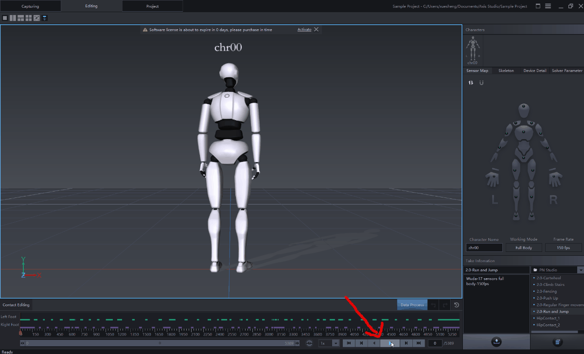

# 
 NEURON MOCAP LIVE Plugin for C4D

This plugin provide the ability to stream motion data from Axis Studio/Axis Neuron into Maxon Cinema 4D.

[Requirement](#id_requirement) 
[Installation](#id_installation) 
[Quick start guide](#id_quick_start_guide) 
[How it works](#id_how_it_works) 
[Connection settings](#id_connection_settings) 
[Skeleton Building](#id_skeleton_building) 
[Recording](#id_recording) 
[Neuron Mocap Live Tag](#id_neuron_mocap_live_tag) 
[Retargeting](#id_retargeting) 
[Setup a model from scrach](#id_setup_a_model_from_scrach) 

## 
Requirement

- Maxon Cinema 4D r23 or higher
- Windows x86_64

## 
Installation

1. Download plugin package from Github release page
2. Unzip the plugin package to C4D plugins folder ( which can be located by click *Open Preferences Folder* button on C4D preferences dialog )
3. Restart C4D

## 
Quick start guide

1. Launch *Axis Studio*, Open a sample motion file

   

2. Enable *BVH Broadcasting - Edit*, configure the broadcast settings as follows:
   - Skeleton: **Axis Studio**
   - BVH Format - Rotation: **YXZ** 
   - BVH Format - Displacement: **Checked**
   - Frame Format - Type: **Binary**
   - Frame Format - Use old header format: **Unchecked**
   - Protocol: **UDP**
   - Local Address: **127.0.0.1:7003**
   - Destination Address: **127.0.0.1:7001**

   

3. Launch *C4D*, open *Neuron Mocap Live* dialog within *Extensions* menu

    

4. Click the *Create Axis Studio Skeleton* button to create a preset skeleton, locate the *Neuron Mocap Live* tag, and configure the *Character Name* which you can get from *Axis Studio*  

    

5. Play the motion file in *Axis Studio* and connect the BVH Stream in *C4D*, done

    

## 
How it works

The BVH stream is routed from Axis Studio to C4D, and there is a *Connection Manager* in C4D to receive this stream, the *Neuron Mocap Live Tags* attached to models will fetch the motion from *Connection Manager* to drive models

## 
Connection settings

- *Procotol*: TCP or UDP, which should be same as Axis Studio Settings
- *IP*: the IPv4 address, which should be same as Axis Studio *Destination Address*
- *Port*: the IPv4 port, which should be same as Axis Studio *Destination Address*
- *Skeleton*: *Axis Studio* work with Axis Studio, *Axis Legacy* work with Axis Neuron

## 
Skeleton Building

- *Create Axis Studio Sekelton*: build a *Axis Studio* preset skeleton with a workable *Neuron Mocap Live Tag*  settings.
- *Create Axis Legacy Sekelton*: build a *Axis Legacy* preset skeleton with a workable *Neuron Mocap Live Tag*  settings.

## 
Recording

- Click *Begin Record* will send *Record* message to *Neuron Mocap Live Tags*, the *Neuron Mocap Live Tag* will perform the record action, so only the models with a *Neuron Mocap Live Tag*  can be recorded.
- The recording data is saved in the tracks of a model with *Neuron Mocap Live Tag*, the tracks of the model should be empty before recording, you can bake the tracks data into a *Motion Clip* before/after recording.

## 
Neuron Mocap Live Tag

- *Character Name*: the character name which should be same with the character name in *Axis Studio*
- *Detect Joints Map*: try to match a joints map by the model's joint name
- *Clear Joints Map*: clear the joints map
- *Set T-Pose*: set current pose as T-Pose, the T-Pose should follow the preset skeleton built from [*Skeleton Building*](#id_skeleton_building)
- *Go to T-Pose*: restore current pose to T-Pose 
- 
*Scale Root Position*
: if checked, the position of root will scaled by leg's height, which will perform a coarse position retarting
- *Joints Map*: the joints map, you can manually setup the map here, the source joint's name will have a *T* suffix if the T-Pose of this joint was saved. The *R*(rotation) controls whether transfer rotation channel data and the *P*(position) controls whether transfer position channel data.

All these settings can be saved to a preset and used next time:

## 
Retargeting

- The *Neuron Mocap Live Tag* has a buildin retarting method, the position retarging of the buildin method is coarse, see [*Scale Root Position*](#id_scale_root_position)
- The C4D buildin retargting is also supported, if you want to use C4D buildin retarting, you should use the preset skeleton built from [*Skeleton Building*](#id_skeleton_building) as source.

## 
Setup a model from scrach

1. Import a model and adjust it's pose to T-Pose

2. Attach a *Neuron Mocap Live Tag* to this model and locate the tag settings

3. Configure the *Neuron Mocap Live Tag* settings

4. Connect, done
